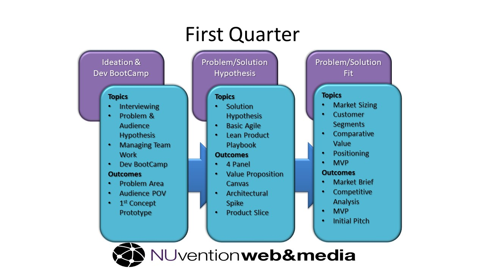
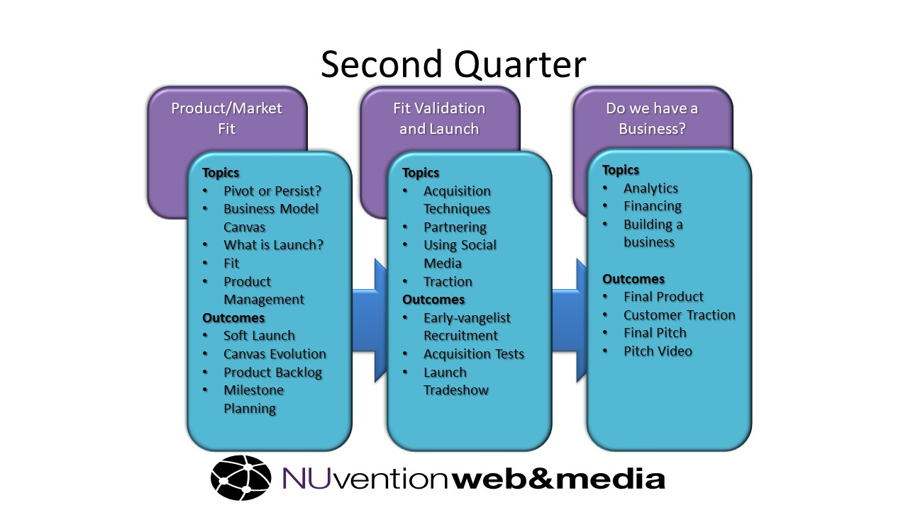

This Year at Northwestern I'm part of the team teaching the 10th iteration of [NUvention Web+Media](https://www.farley.northwestern.edu/we-teach/nuvention/web-and-media.html), a two-quarter class focused on developing a web, mobile, or media startup. Over 400 students and 50 teams have gone through this 20-week process. This post gives some background on the course, and what we are doing this year. We held our first class January 7th.

#### How to Build a Web Startup in 20 Weeks or Less

This is how I often describe the NUvention web course. In its current iteration, teams of 4 to 6 students work to determine a startup concept, validate the concept using customer development and lean startup techniques, and build and launch the product to customers before the end of the course. The course can be thought of as a mash up of a product-oriented software engineering course and the lean launchpad entrepreneurship curriculum. Teams get and build a product; and many teams are serving users and generating revenue by the end.

#### Teams

Teams consist of students drawn from across [Northwestern University](https://www.northwestern.edu). A large percentage are undergraduates and graduates in the McCormick School of Engineering, but many are from the Kellogg School of Management, Medill School of Journalism, and The Weinberg college of arts and sciences. Each team divides roles between focuses on customer development and product development. While the course is located in Farley Center of Entrepreneurship in engineering, in the past few years, we have had a strong relationship with the [Medill Masters Program focused on media innovation and entrepreneurship](https://www.medill.northwestern.edu/journalism/graduate-journalism/specializations/media-innovation-and-entrepreneurship/index.html). Students apply to the course, and we hold a series of student mixers in the fall to help applicants to get to know each other and form teams. This year we are starting with 7 teams. While computer science students have formed the foundation of each of these teams, we are happy this year to have one of the largest number of them; which is likely a reflection of the growing popularity of the CS major (which undergraduates can do in either the engineering school or in arts and sciences) at Northwestern—It’s now the second most popular major overall!

#### Teaching Faculty

When we launched the course in 2010, the core teaching team was Mike Marasco, director of the Farley Center and me; with strong support from a number of other faculty and especially Chris Riesbeck in the computer science department to help advise teams.  
As the course has evolved, our faculty team has grown to include four “pracademics”—people with a mix of academic and industry experience. The faculty, in addition to me, are:

- [Rich Gordon](https://www.medill.northwestern.edu/directory/faculty/rich-gordon.html), Professor and director of digital innovation in the medill school
- [Michael Marasco](https://www.farley.northwestern.edu/we-teach/faculty/michael-marasco.html), Farley Center director
- [Tom LaMantia](https://www.magenium.com/About-Us/Leadership/tom-lamantia), a successful Chicago area entrepreneur who most recently sold [Magenium Solutions](https://www.magenium.com) to [AVI System](https://www.avisystems.com/).
- [Rich Padula](https://www.farley.northwestern.edu/we-teach/faculty/rich-padula.html), like me an alum; and unlike me a successful entrepreneur, Rich built and sold mobile business application company Syclo to SAP and is currently involved in a number of new ventures.
- [Chris Riesbeck](https://www.cs.northwestern.edu/~riesbeck/), associate professor of computer science; and all-around experiential teaching wizard and wise man.

We again also have [Tran Ha](https://www.farley.northwestern.edu/we-teach/faculty/tran-ha.html) teaching our first sprint on customer development and developing a user point of view.

We also augment the teaching team with a large set of volunteers, the NUvention Web Advisory Board, who coach our teams and provide feedback on what they are doing. One great benefit of running the course this long; is some of our best AB members are students who took (and many who TA’ed) the course in the past!

#### Curriculum

The course runs over 20 weeks in two 10-week academic quarters. Students present their projects formally to advisory board at the end of each quarter. (you can see a recap of one of these [here](https://www.farley.northwestern.edu/we-teach/nuvention/web-and-media.htm)). We organize the course into six three-week ‘sprints’; with a week at the end of each quarter for teams to focus on the formal AB meeting.

##### NUvention Web Sprints Winter and Sprint Quarters

##### Our sources of inspiration

As mentioned, the curriculum is a mash up of software engineering and lean launchpad entrepreneurship program. We draw from agile software development (and especially variants like extreme that focus on continuous deliver of user value) and the lean launchpad curriculum. In the last 4 years, we have also strengthened our product management curriculum through the advice of Northwestern alum Dan Olsen. While the focus of the course is experiential, we draw on some specific readings from the following books:

- [The Agile Samurai](https://www.amazon.com/Agile-Samurai-Software-Pragmatic-Programmers-ebook/dp/B00AYQNR5K/ref=sr_1_1?ie=UTF8&qid=1546882798&sr=8-1&keywords=agile+samurai). We use this to introduce the concepts of agile development and backlog
- Talking to Users
- [The Startup Owners Manual](https://www.amazon.com/dp/B009UMTMKS/ref=dp-kindle-redirect?_encoding=UTF8&btkr=1). Steve Blank and Bob Dorf’s encyclopedia of modern entrepreneurship and the foundation for the NSF/VentureWell Lean Launchpad curriculum
- [Lean Product Playbook](https://www.amazon.com/dp/B00SZ638C8/ref=dp-kindle-redirect?_encoding=UTF8&btkr=1). Dan Olsen’s book helps teams with honing their product and value proposition; and moving from a high level value proposition to specific features that serve identified customer needs and fill the agile backlog.
- Talking to human. A pre-read to ground students in the core work of “hand to hand” customer development. The research has shown that teams that do more than 100 customer interviews have a much better chance of developing a winning product concept and business.

##### Class Experience

The class meets once a week for three hours. While there is a small amount of lecture; most of the time is focused on in class exercises that include team critique as well as working simultaneously on specific concepts; like developing a user point of view or product position, that are immediately evaluated, and teams given feedback. We also work to have one third to half of class set aside for teams to work together and for our faculty team to work on coaching them individually.

##### Coding bootcamp

Last year, in the first three weeks of class, we added a “coding bootcamp”. The focus of the coding bootcamp is four things:

- Understanding how to rapidly prototype a web/mobile product as team. Teams “practice” on a faculty assigned area and set of user stories.
- Gaining familiarity with the current toolset in team development by practicing building something. Here we focus primarily on using [GitHub](https://github.com).
- Quickly Learn a modern web/mobile “fullstack” framework. This year the focus is on [ReactJS](https://reactjs.org) with [Firebase](https://firebase.google.com) at the backend.
- A practice session with the whole team developing an initial set of stories and a static prototype of their hypothesis idea.

#### What We’ve Learned and What’s New

This year’s curriculum is the sum of our previous lessons---no two NUvention Web courses have been the same. A key lesson is that the first sprint is focused on practice of the fundamentals of the course: customer development and agile development. Tran ha, who has taught in our course the last two years, teaches a module for us where students develop a user point of view on a pre-assigned topic with interviews before students dive into their own project. Additionally, we have added more work in developing initial concepts that focuses on teams developing their own view of their competitive advantage as team. This work builds directly on the research in [Effectuation](https://en.wikipedia.org/wiki/Effectuation) by Saras Sarasvathy. We also tried an experiment last year where we move away from Alexander Osterwalder’s [business model canvas](https://strategyzer.com/canvas/business-model-canvas). We are re-introducing that to help give students the larger picture of building a business vs. simply building a project that meets a need.

#### What Have Students Developed in Past Classes

We have had many interesting and varied projects in the last few years. Some focus on student experiences—a team two years ago developed something called Juggl that helped graduating seniors navigate the job market; and last year a team built a tool to help students navigate the MBA application process. Others focus on student life—there is usually a project that works with local businesses to help them attract students; or to help students find fun experiences. One year we had a team develop a Bluetooth bike lock and undertake a crowd funding campaign. Last year, one of the best received ideas, Perf, focused on buying perfume online. We also had a team last year focus on using blockchain to manage job application information.

For me, NUvention Web+Media is a labor of love, and I’m looking forward to seeing what happens this year!
