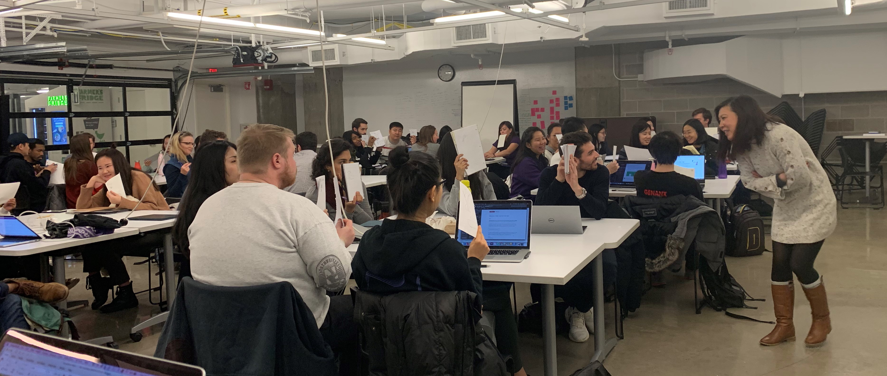
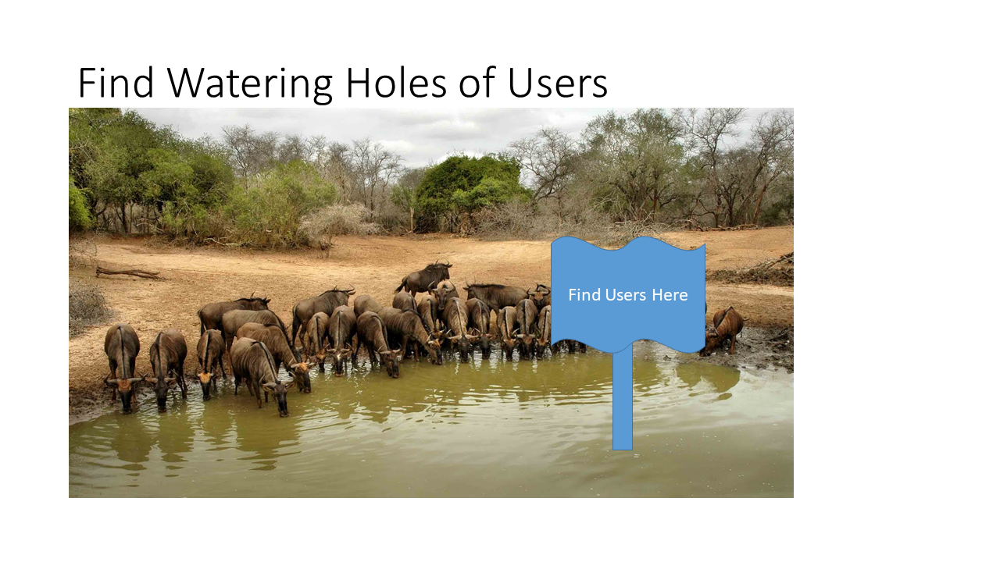

In NUvention web, we have student teams develop their own ideas as the seeds for their startup. We’ve tried to do this several different ways, and frankly I’ve come to not even like the word “idea” because I think it is too vague and too often confused by students and would be entrepreneurs as solutions. Therefore, in the first set of classes; we work with students to better observe customers and determine the jobs to be done. This started in our first class last week. The work of interviewing is so important we have students practice their skills on a practice problem—way finding on campus. Tran Ha has led students through this exercise the last 3 years, drawing on reading from Giff Constable's [Talking to Humans](https://www.talkingtohumans.com/) and Erika Hall's [Just Enough Research](https://abookapart.com/products/just-enough-research).

<!--more-->

Too often, the initial idea sounds a lot like this extranormal video that Jerry Engel shows in his lean Launchpad seminars:

<iframe width="800" height="640" src="https://www.youtube.com/embed/WnPjqt6vEzA" frameborder="0" allow="accelerometer; autoplay; encrypted-media; gyroscope; picture-in-picture" allowfullscreen></iframe>

#### Use the team's experience as a starting point

I think it’s natural to start from solution; but not helpful for developing the business concept. It’s more useful to start with problems, or “jobs to be done” by different audiences that need to do those jobs. Tran talks about focusing on "problem finding" rather than "problem solving."
The best teams in NUvention web, especially those that have continued for more than a year after the class, have all built products based on problems and audiences they have encountered. Four examples from the past:

- The team of Nikhil Sethi and Garrett Ullom of Adaptly were on in the first year focused on a problem Nikhil encountered as an intern analyzing social media marketing buys at a Silicon Valley startup.

- Jeremiah Seraphine, the founder of Groovebug, was a DJ and ran a record label before creating his iPad music magazine with his team in 2011.

- LicenseBuddy, which evolved into TradeUp Labs, was based on work a team member had done understanding continuing education requirements for CPAs as a CPA himself. The initial concept helped professionals find continuing training classes and helped them keep track of what they had taken. The pivot TradeUp, helped developers find courses that would let them “level up” their skills to current employment requirements.

- Barlift, which provided deals at local watering holes, came from some students who had run a mailing list of local deals. It evolved into an app with more than 8000 downloads and multiple local establishments as paying customers by class end.

To start off, we ask teams to build an inventory of audiences and problems they know. This matches the advice provided in Stuart Read and Sara Sarasvathy in [Effectual Entrepreneurship](https://www.amazon.com/Effectual-Entrepreneurship-Stuart-Read/dp/1138923788).

#### Get out of the building! More than 100 times

From here, teams can produce a hypothesis customer set and potentially a hypothesis activity where their product will assist. Then the work is validating the space by getting out of the building.
Usually, students must learn to go back to potential audiences with an open mind to look for the high priority problems they have. This is the core work of customer discovery, and our experience in NUvention Web as well as based on data analyzed by [Launchpad Central](https://launchpadcentral.com) (which makes a tool to aid teams in managing customer discovery) indicates it will take 30 to 40 interviews in the early weeks of their venture to provide some initial validation or to invalidate a bad idea; and more than 100 interviews over the course of a 10 week period. Successful teams that find a real need and strong segment tend to greatly exceed the 100-interview mark.

#### Find a watering hole

Early on, teams that are successful identify a place where similar types of customers congregate. We call these places “watering holes”. A good example of a watering hole from the 2018 class of NUvention Web+Media comes from Team “Perf”. Perf started with the idea of looking at the fragrance market and how to be disruptive. Early on; they set up in a shopping mall and interviewed many people to understand how they talked about fragrance. As they began to refine the product concept to look at using personality traits to determine fragrance; they returned to the same spot to test a paper MVP that took people through their “fragrance quiz”.

Another important initial validation of a space to pursue is getting agreement from the entire team on where to focus. Usually, if you can’t convince the team it’s a good space; the team isn’t going to be able to convince potential users either. In future posts, I’ll talk about both team dynamics; and how to constructively evaluate different concepts to refine to the best to pursue based on what we have seen in the ten years of delivering NUvention Web.
