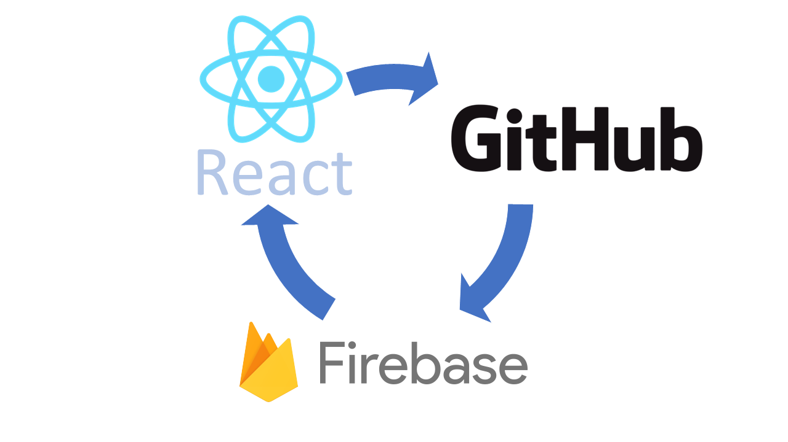

<!--  -->

Starting in 2018, we have kicked off NUvention Web with a "coding bootcamp" focused on practicing team software development skills to get teams ready to go in NUvention Web. This year, we ran the camp in three evenings. The first two have focused on developing a sample project by running through a set of tutorials. The technical skills focus on getting familiar with GitHub, ReactJS, and hosting applications using Google Firebase. The final bootcamp, we brought in the full teams to work together to run a 3 hour iteration to prototype a slice of one of their ideas.

<!--more-->

#### Goals of the Bootcamp

As I articulated in [the course overview post]({{ site.baseurl }}), there are three goals of the coding bootcamp:

> - Understanding how to rapidly prototype a web/mobile product as team. Teams practice on a faculty assigned area and set of user stories.
> - Gaining familiarity with the current toolset in team development by practicing building something. Here we focus primarily on using [GitHub](https://github.com).
> - Quickly Learn a modern web/mobile “fullstack” framework. This year the focus is on [ReactJS](https://reactjs.org) with [Firebase](https://google.com) at the back-end.
> - A practice session with the whole team developing an initial set of stories and a static prototype of their hypothesis idea.

#### Tools and Technology Selection

When we first started; we were not prescriptive about any of the toolset students used. The trend by 2012 was students using GitHub to hold all NUvention products; moving away from older products like SVN and SourceForge.

For building their applications, we were also neutral, and we still let teams self determine their toolset. Sometimes we have provided a list of popular tools and environments. In the early years, teams were divided primarily between ruby on rails for web, and ios first (In Objective C and now many in Swift), android second on the front end. As we moved to the middle of the decade, we transitioned to "serverless" initially wth Facebook's Parse and Salesforce's Heroku. Now we primarily suggest Firebase and for teams who have experience with it, AWS. Since 2014 many teams have used one page web application frameworks and their mobile brethren like Angular-Ionic and now ReactJS-ReactNative.

#### GitHub

GitHub has been an innovation in helping to teach programming. Having a standard repository, with an api for instructors to aggregate statistics, a method to submit change requests and comment on code is terrific and we use it. "Status Reports" in the second half become pull requests of progress in the spring quarter. Over the years we have also seen a transition in our students. Early on in teaching NUvention, most students who had not been in industry had never experienced source code control. Now, more than half have at least basic experience in GitHub--even if they are an undergraduate sophomore. This is terrific because we can now focus more on group workflow and developer workflow with the other non-developer team members. As the scope of GitHub's offering has increased, we've also taken advantage of their broadening toolset to support the full development cycle.

In surveying other courses, we know that many software engineering classes use tools like [Pivotal Tracker](https://www.pivotaltracker.com/) (for example the [Berkeley Agile Course](https://www.edx.org/professional-certificate/agile-development-using-ruby-rails)). Some of our teams in the past have used [Basecamp](https://basecamp.com/) or [Trello](https://trello.com); but the integration of issues with source code control; and the addition of [GitHub Projects](https://help.github.com/articles/about-project-boards/) (A [Kanban Board](https://en.wikipedia.org/wiki/Kanban_board) / Trello like feature added to GitHub two years ago) has made GitHub "good enough" for our project management purposes.

#### ReactJS

In the first iteration of the bootcamp in 2018, we used [Angular](https://angular.io). One thing we found was while we spent time on teaching Angular; we still let teams self-determine the stack for their main project. Two of the eight teams selected Angular, two teams did an [Ionic](https://ionicframework.com/) mobile app (Ionic is based on Angular), one in addition to their Angular app also did a Slack bot in node, and four teams used ReactJS. Because half the teams did React, since ReactJS is more popular, and because we found the learning curve with Angular to be steep (only two of the dev teams completed the project in 2018--which is a curricular problem not just about the Angular learning curve) we chose this year to try ReactJS. We considered [VueJS](https://vuejs.org/); which Chris Riesbeck has used; but he found that when he used VueJS in his 394 class many students switched to ReactJS.

There is a lot to like about using ReactJS for this kind of coding bootcamp. In particular, most students have some familiarity (although to be fair it can be scant) with JavaScript; and while I **love** Typescript it is an additional hurdle and set of tools. It's also a thinner framework which really lets us focus on prototyping, designing the UI and interaction, which helps for the third night where students prototype a current idea. Because the components are lighter weight, we have less to teach in terms of overall scaffolding.

We did find some things conceptually that were a leap:

- While the introduction to programming at Northwestern is in [Racket](https://racket-lang.org/) which is functional, there is still a leap for many students; especially on really understanding the immutability of state.
- Some students who have more a systems/C++ background have a hard time grasping that it looks like C but acts like JavaScript (prototypical inheritance, preference for array operators over for() loops).
- JSX sort of blows their mind. Even if they understand HTML and JavaScript; getting what can and cannot be done in the JSX took some work.
- the "typelessness" of JavaScript definitely provides more ways for students to get stuck

Other things are endemic difficulties with modern JavaScript programming taught to people who were born after Windows 95 and the dominance of command line interfaces (remember a student born in 95 is 23-24!):

- NPM can be quite mysterious--\***\*what is it doing? why all that stuff in node_modules?\*\***
- Transpiling and new ES6-isms (arrow functions, import syntax, `this` even more complicated than classic JavaScript)
- File management and the command line. Some students definitely took a bit to grasp relative directories for example.
- Promises / `async` / `await`

All that said, we found some excellent resources. First and foremost, [Thinking in React](https://reactjs.org/docs/thinking-in-react.html) was quite a good introduction in terms of how to get students to structure their thinking around both the UX and hierarchy of components and reusability. (though it had oddities--why does it us a `for()` loop instead of `array.map()` which is the more modern convention?). We also referred to [Modern JavaScript](https://javascript.info/) and as a reference the [React Handbook](https://medium.freecodecamp.org/the-react-handbook-b71c27b0a795). The [React Dev Tools](https://github.com/facebook/react-devtools) were also great for helping students understand what was happening in their programs. Our TA's, Chris and I gave some impromptu tutorials of the Google Chrome debugger. We were not prescriptive about editors; but next time we will really push [VS Code]("https://code.visualstudio.com/) which with intellisense and support for JSX in the editor is a big time saver as someone learns.

Some things did end up being "a bridge too far": Understanding [higher order components](https://reactjs.org/docs/higher-order-components.html) for example. I like ReactJS well enough now after this experience. Previously I had been a devotee of Angular. I still like it's completeness. I hope to write a post comparing the pluses and minuses of each framework. The TL;DR on the comparison is I wish ReactJS had dependency injection as opposed to the layers of hacks (context! hooks! Redux!) to get state up and down the component tree; and I wish Angular had functional components for things that are small, simple and light.

#### Firebase

I've been a fan of Firebase as a database technology that is accessible to beginners since [James Tamplin](https://tamplin.net/about.html) gave me an online demo 10 years ago. I think generally it's even better since its been Google-ized: Firebase Cloud Functions are great; Firebase Auth greatly simplifies integrating with OAUTH systems, and Firebase Hosting has GitHub hosting beat as a great, cheap, easy solution to test stuff out. It's also more accessible than Heroku (and certainly more so than Azure or AWS Elastic Beanstalk).

The big thing we used Firebase for was hosting the first two tutorials. Next time, we will have students host earlier then we did this year. It gives students a feeling of accomplishment (Look Mom I'm on the Web!) and makes it easier for us to benchmark student progress. Chris even wrote a nifty little JavaScript application that shows on one page the hosted sites of students and links to their git repositories!

In my opinion, integrating Firebase is more awkward in ReactJS than it is in Angular; in part because of ReactJS's lack of dependency injection and reliance on promises vs. [RxJs](https://rxjs-dev.firebaseapp.com/) (though RxJs is probably even harder than High Order Components and promises from a learning curve perspective). [AngularFire](https://github.com/angular/angularfire2) also eases the pain on Angular. To integrate Firebase in for authentication, we pointed people to two tutorials: A simple one with a [video](https://github.com/lingonsaft/React-FirebaseUi-Authentication) and a more [industrial strength one](https://www.robinwieruch.de/complete-firebase-authentication-react-tutorial/) that relies on Higher Order Components.

#### Development and Class Process

In advance of the three nights of bootcamp, we pointed people to the [Basic React Tutorial](https://reactjs.org/tutorial/tutorial.html). We asked students to do it with "real files" as opposed to an online environment like [Codepen](https://codepen.io/gaearon/pen/oWWQNa?editors=0010). They pushed the results to a public GitHub repository.

The first two classes we had developers work on implementing a [sample shopping cart app](https://react-shopping-cart-67954.firebaseapp.com/) **(special thanks to [Jefferson Ribeiro](https://github.com/jeffersonRibeiro)!)** using it's source code and data (JSON "database" and photos) as a reference. We did not use [Redux](https://redux.js.org/) though the [sample source](https://github.com/jeffersonRibeiro/react-shopping-cart) does. We defined a series of work items as a backlog, so that git commits and pushes were done along the way; and issues in the backlog were closed. You can see [my implementation of the tutorial](https://toddw-boot19-shop.firebaseapp.com/) and see [the code and issues](https://github.com/toddwseattle/new-shopping-cart) in GitHub to see the flow.

The third class had teams work together to build a working prototype of one of their lead product concepts. This class was incredibly successful on several levels; and I will probably write a whole post about it. We had the teams quickly develop a [4 panel storyboard](http://allcritiquesgreatandsmall.blogspot.com/2015/01/the-4-panel-storyboard.html) in the first half hour based on the customer interviews they had done so far. Then we put them to work implementing a slice of it time boxed to the 2.5 hours remaining in the class. I was impressed by the collaboration. I saw students working together to build their storyboards. As the task moved from storyboards to implementation, the "non-developers" on the team focused on supporting tasks--sketching UI flow, developing digital assets, and developing real data to display in the prototype. One doesn't need to be a developer to help get a prototype put together and become realistic to show to potential customers.

Our goal was prototypes, not just mock-ups--programs driven from data that matches real schema and data points that students observed in their interviews. On this point the bootcamp succeeded. Many of the prototypes will be thrown away; but the progress in collaboration and decision making in the practice of the exercise should help team dynamics through the course.

#### What we did last year and what's changed

Last year--like this year--we focused on having our computer science students learn a modern web framework, and implement a project devised by the faculty. Last year, we focused on [Angular](https://angular.io) as a framework and a scenario that was to create a status report sending application from GitHub. Only 2/20 developers successfully completed the project, indicating we were too ambitious relative to baseline skills and the time we had. As mentioned previously, less than half of the teams ended up using Angular or the related mobile technology Ionic. We had a [structured tutorial](https://github.com/toddwseattle/NUwebbootcamp0) to begin with; but the tutorial this year was much better. Having students start with a small tutorial and then having a "living spec" for the result a better approach. Both had the effect of acting as a good diagnostic for the faculty team on where our developers skills are, and helped teach some valuable lessons around scoping and breaking down a set of features and implementing a scenario.

#### What we've learned as instructors so far

Six takeaways:

- It's important to have a small but focused pre-assignment to make sure students arrive ready to code on day 1. It insures that the students toolset and public accounts are setup and ready to go.
- Using an existing example in the framework with all the working components, and having the students implement it in a lab style setting was useful.
- Having an architectural example of how to break down a feature into components, like in "thinking in react" is useful to bootstrap students from computer science class assignment to active thinking about user and customer value; and building useful applications.
- Having deployment sooner rather than later is important. While Agile generally recommends this, it was clear that being able to move through the whole cycle quickly had great value.
- JavaScript is still a quirky language to learn--even for computer science students grounded from the beginning in functional programming. The "head fake" of C/Java like syntax warrants some explanation and discussion up front.
- Having the team work together--product development and customer development--quickly on an implementation, time boxed to show a slice of functional results is tremendously valuable. I would suggest that non-student startup teams spend a day early on doing a similar exercise to get on the same page and work together to clarify assumptions and ground user experience.
