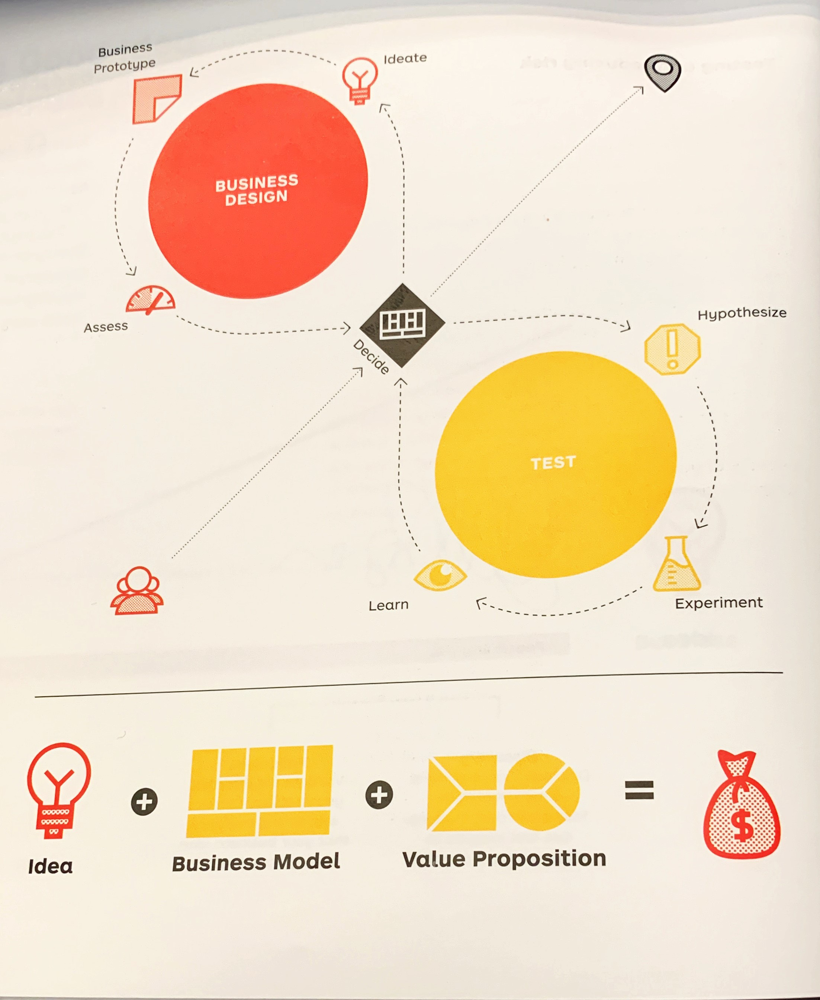
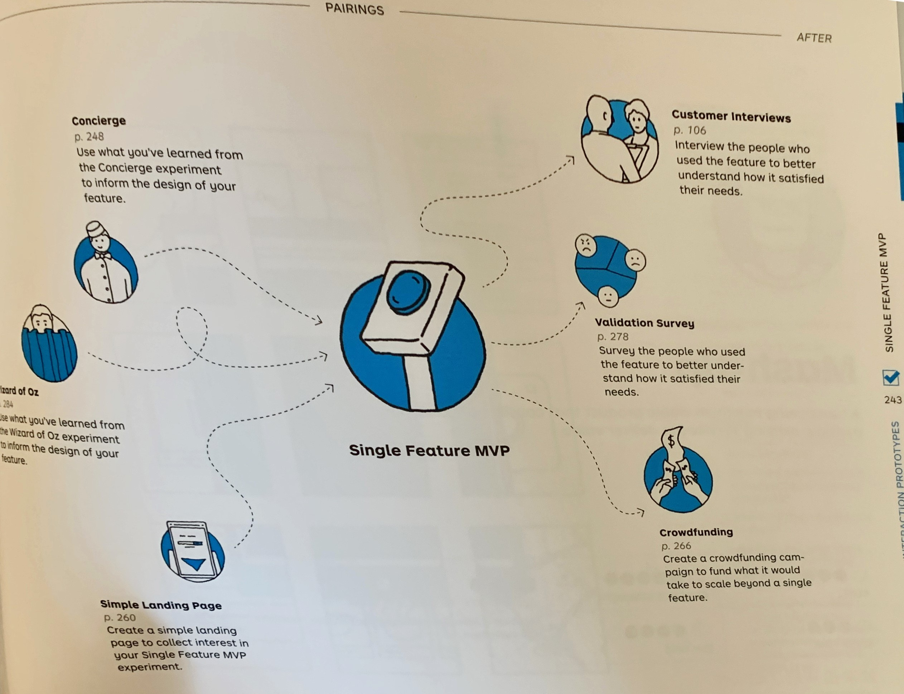

In early December, I had the opportunity to attend the [Lean Innovation Educator's Summit](https://steveblank.com/2019/11/19/we-needed-a-bigger-room-the-lean-educators-summit/). We were lucky enough to have Dr. [Alex Osterwalder](http://alexosterwalder.com/) present some ideas from his new book [_Testing Business Ideas_](https://www.strategyzer.com/books/testing-business-ideas-david-j-bland) co-written with [David J. Bland](https://precoil.com/services/). The book is fantastic, and along with Alex's first two books, [_Business Model Generation_](https://www.strategyzer.com/books/business-model-generation) and [_Value Proposition Design_](https://www.strategyzer.com/books/value-proposition-design) provide a trio for Business Strategists and Entrepreneurs on par with what Don Knuth's [The Art of Computer Programming](https://www-cs-faculty.stanford.edu/~knuth/taocp.html) did for the basics of computer science. This post will give my summary of the book, insights, and applicability. In short, if you are an entrepreneur, startup investor, involved in setting strategy in a company, or an entrepreneurship educator **go buy this book!**.

<!--more-->

#### Testing Business Ideas

Testing Business Ideas is a practical guide for entrepreneurs and business strategists providing a process and cookbook of modern experiments to help you test the elements of your business: understanding a customer segment's needs, determining which elements of your value proposition resonate, determining pricing, understanding which kinds of customer relationships and distribution works; and strategies for demonstrating the feasibility of producing your product and running your business. As someone who has been involved in setting strategy at big companies; as an investor who has worked with Startups in advance of product/market fit, an entrepreneurship educator and sometime solopreneur; _Testing Business Ideas_ is valuable in all four capacities.

The Book is broken down into four sections, which provide a system for:

1. **Designing Experiments**: How to link to the Business Model Canvas and Value Proposition Canvas; and how they fit with your business journey and team.

2. **Testing**. How to run the process, including ranking uncertainties and determining which experiments to run.

3. **Experiments**. Specific experiments; and a roadmap for different kinds of businesses

4. **Mindset**. The pitfalls of teams and best practices; as well as how to integrate into a corporate strategic planning process and timeframes.

#### Who Should Read _Testing Business Ideas_

_Testing Business Ideas_ is essential reading for entrepreneurs, corporate managers involved in setting strategy or starting new businesses within the firm and venture capitalists who evaluate and coach startup teams. I know the book is good as in five meetings (a VC partner meeting, coaching a founder, a board meeting with a portfolio company, my teaching team meeting for NUvention Web and Media) following my first read, I pointed to specific pages in the book and told each person to order one.

I think when I was at Microsoft in many of my GM roles (Small Business Server, Microsoft Maps, Project, Mobile) it would definitely have been helpful as we built new business models or evolved new products from our existing businesses.

#### Where the Trio of Books Fits

[Alex Osterwalder](http://alexosterwalder.com) and his team at [Strategyzer](https://strategyzer.com) have had a huge impact on the field of Business Strategy and Entrepreneurship in the last 10 years. The book Business Model Generation, and he Business Model Canvas are an essential modern tool for understanding the structure of how a firm works. Osterwalder and his team built on these ideas by zooming into the value proposition and customer profile with the Value Proposition Canvas.

The Business Model Canvas structures the activities of the firm into 9 boxes:

The Value Proposition Canvas zooms in on the value proposition and customer segment portions of the canvas to provide more detail:

While experiments are lightly discussed in the Value Proposition Canvas, _Testing Business Ideas_ puts it front and center; and provides a specific roadmap for experiments for different types of business for different elements of both canvases. Taken together, the three books provide a comprehensive view of understanding the capabilities and structure of a new business, potential new opportunity for a larger business, or analysis of the strengths and weaknesses of an existing business.

#### Book Summary and Structure

_Testing Business Ideas_ builds on Osterwalder's two prior books, [_Business Model Generation_](https://www.strategyzer.com/books/business-model-generation) and [_Value Proposition Design_](https://www.strategyzer.com/books/value-proposition-design). The book proposes an iterative process that moves between prototyping your business design and testing your hypotheses with appropriate experiments. The framework for the business design is the Business Model Canvas and it's detailed sub-component the Value Proposition Canvas. The book provides a set of processes and tools for each element of testing your business design; and a cookbook of experiments as well as a roadmap through those experiments for different types of businesses and situations. The diagram below from the book puts it in context[^1]:

[^1]: Bland & Osterwalder, _Testing Business Ideas_, 2020, p x

##### 1. Designing Experiments

The book briefly reviews the Business Model Canvas and the Value Proposition Canvas and connects it to the process of experimentation. It also touches on issues of experimental process, team dynamics, and linking where you are in the journey from business discovery (high uncertainty) to business execution (more certainty and product/market fit). It proposes a meta-process for balancing business design and experiments; and how experiments change as the business evolves and (hopefully) becomes less risky and more certain. The parts on team dynamics are useful, but brief; and allude to another book under development by the Strategyzer team, The [Team Alignment Map](https://www.teamalignment.co/)

##### 2. Testing

The testing section discusses how to run the process, including ranking uncertainties and determining which experiments to run.
It includes tools to help you rank your uncertainties around Desirability, Feasibility, and Viability to determine which experiments to run. What makes a good hypothesis (it should testable, precise, and discrete). How to order testing. What experiments provide weak or strong evidence.

For example, in designing a test, Bland and Osterwalder have a useful format in their "Test Cards"[^2]:

[^2]: Bland and Osterwalder, p45

> We believe that ...  
> To verify we will ...  
> And measure ..  
> We are right if...

For each test, they are ranked on the criticality to the business, cost, reliability, and amount of time to administer. Different phases require different degrees on each of the scales.

This formalism is a huge insight and advancement in process for teams in customer discovery. While [Steve Blank](https://steveblank.com) with customer development urged us to "get out of the building"; often I have seen startups and teams struggle with how to do it effectively and how to put it in context with the active hypotheses around their product and business. _Testing Business Ideas_ adds rigor to make getting out of the building effective.

The book provides a comprehensive process for managing experimentation in your teams; adopting methods from agile/sprint development methodologies to keep track of the work and prioritize; but also celebrate success and suggests different methods to involve and inform stakeholders and management outside the team.

##### 3. Experiments

The bulk of the book is spent on specific experiments that can be run to acquire actionable data on the business hypotheses. The experiments are organized in two major sections, **Discovery** and **Validation**. Each of the 44 experiments is weighted on cost, setup time, runtime, evidence strength, and which major theme or themes (Desirability, Feasibility, Viability) it fits with. For discovery and validation they provide a number of different types of experiment types:

###### Discovery

- **Exploration**, which includes interviews and observations with customers and stakeholders
- **Data Analysis**, which includes "netnography" technics like search trend analysis and internal feedback from customer service and sales force.
- **Interest Discovery**, which is focused on online techniques like ads, email campaigns, and referrals.
- **Discussion Prototypes**, which are ways of making the value proposition come to life, whether 3D printed, in data sheet or a video explainer.
- **Preference and Prioritization Discovery**, to help sort value proposition priorities. these are techniques like the product box and card sorting.

###### Validation

- **Interaction Prototypes**, these are things like providing concierge service, building a clickable prototype, or a single feature MVP.
- **Call to Action**, tests like landing pages, crowdfunding, or pre-sale.
- **Simulation**, like "Wizard of Oz" where the team performs the actions behind the curtin, or making a mock sale.

Helpfully, Bland and Osterwalder provide a great roadmap for different types of situations through the experiments themselves

###### Experiment Sequences and Pairings

Helpfully, Bland and Osterwalder provide what they term "Experiment Sequences" for different types of businesses and uses. For example, with B2B Software; they suggest the following order:

- Customer Interview
- Online Ad
- Simple Landing Page
- Email Campaign
- Clickable Prototype
- Mock Sales
- Wizard of Oz

Additionally, for each experiment, a set of experiment pairings is shown, with related experiments that put it in context. For example with the "Single Feature MVP":[^3]:

[^3]: Bland and Osterwalder, 2020 p243

##### 4. Mindset

The final section is focused on developing an experimental "Mindset". It has an especially helpful section on "Experiment Pitfalls" that teams should read before they apply the experimental process.

It also has great sections on how to incorporate the test centered process into strategic planning. It advocates a "VC" mindset that looks at investments in seed, launch and growth mode over a longer timer horizon than typical corporate planning. These are great suggestions, if based on my experience with corporate planning at Microsoft hard for companies to change their culture to follow. For example, the cross functional teams suggested in the book are design, engineering, and product management; but generally my experience was finance led the bigger corporate planning processes, and this method likely would blow their mind, but significantly advance their work.

#### The Gems

The real diamonds of _Testing Business Ideas_ are putting experiments many startups and lean startup educators have been using in context with a process to use in concert with the Business Model Canvas and the Value Proposition Canvas. Additionally, at least for me, there were several new experiments or sections on classic techniques I found especially useful and insightful:

- **Interviewing**. In NUvention Web and Media, we still require Constable, Rimalovski, and Fishbourne's [_Talking to Humans_](https://www.talkingtohumans.com/) as the introductory text to ground students in how to think about talking to customers. Testing Business Ideas breaks interviewing in to multiple techniques; and has a good brief how to think about preparing for and debriefing interviews. Interviewing covers multiple experiments in the book from from "discovery' to "day in the life" as well as talking to stakeholders and suppliers.

- **Experiments you might not of thought of**. In the talk I saw Osterwalder give, he went through the **Speed Boat** experiment, which is a way to get customers to articulate what things are accelerating or slowing down their progress. Others that made me think 'new and neat-o' where **Boomerang** that has you do your testing a competitive product. **Pretend to Own** is a good empathy experiment where the team uses a prototype and notes pitfalls. My guess is even experienced practitioners will find new techniques to try.

#### Where to Supplement

While a great book, there are certainly areas to supplement. While the interviewing section is a good start, much work has been done in this field. Especially if "Day in the Life" analysis is important to your project, the best book is still Holtzblatt and Byers [_Contextual Design_](https://www.incontextdesign.com/our-books/); which has terrific methods for visualizing how customers interact with stakeholders around them and their environment.

I think storyboarding is an important and underused technique; and I found this experiment lacking. I much prefer my colleague [Chris Riesbeck's Four Panel Storyboard](https://courses.cs.northwestern.edu/394/four-panel-task.php) which we have been using for many years in [NUvention Web+Media](https://www.farley.northwestern.edu/we-teach/nuvention/web-and-media.html). Likewise, I like the single function MVP test; but [Chris's description of the One Button App](https://allcritiquesgreatandsmall.blogspot.com/2012/04/one-button-app.html) is slightly better.

A general criticism of the trilogy, is that scant attention is spent on the competitive environment of the firm. For this good supplements are [Steve Blank's Petal Diagram](https://steveblank.com/2013/11/08/a-new-way-to-look-at-competitors/) and [Michael Porter's Five Forces](https://en.wikipedia.org/wiki/Porter%27s_five_forces_analysis). For the Value Proposition Dan Olsen's **Comparative Value Proposition**, described in the [_Lean Product Playbook_](http://leanproductplaybook.com/) is a good technique.

#### How I'm Using it

I've been using the book informally since mid-december with startups I'm advising. Some of them have received "homework" directly out of the book. More importantly, we are adopting it as a core book in NUvention Web+Media this year. I mentioned we've used storyboarding, and a simplified MVP in the class; but in recent years we have also used ads and landing pages so the book helps us put those in context; as well as linking them back to the Value Proposition Canvas and Business Model Canvas.

#### Conclusion

The team at Strategyzer has done it again! With _Testing Business Ideas_ you will learn neat new ways to test, and a better process for integrating it with your organization or teams you are coaching. If you are involved at all in designing new products to take to market or developing new businesses, this should be the first book you read in 2020.
