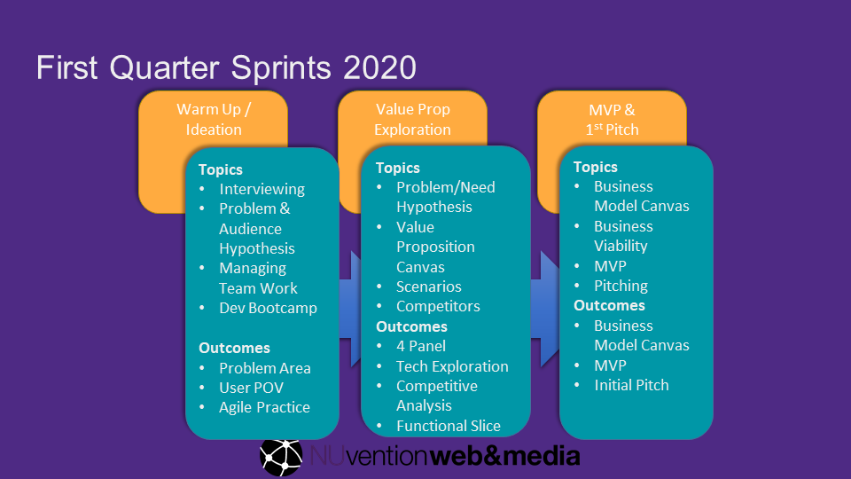
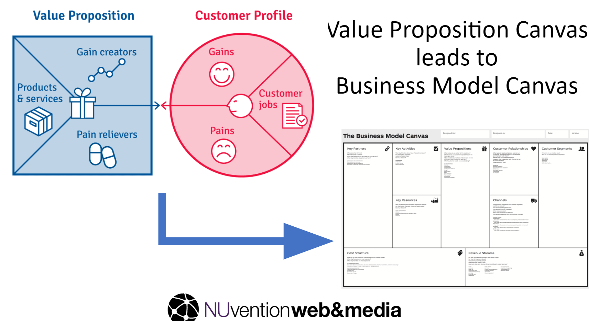

Since January, I have been co-teaching the 11th iteration of [NUvention Web+Media](https://www.farley.northwestern.edu/programs-and-support/nuvention/web-and-media.html) at [Northwestern University](https://northwestern.edu), where teams of students,
undergrads and grads from across the University come together to learn how to build a web startup over 20 weeks
(two quarters).

This post is a recap of the first quarter in 2020.

With the COVID-19 Pandemic, the course has moved to online
for the second quarter, that portion will be described in a [second post](../2020-04-10-NUvention-Web-Spring-2020). This year we made many changes including adopting [Testing Business Ideas](https://www.strategyzer.com/books/testing-business-ideas-david-j-bland), introducing a new way of grading, and a new exercise for team's to determine their starting point.

#### Curriculum

As usual, we continue to evolve the class based on feedback and a summer post-mortem. A change made last year, using the
Value Proposition Canvas, is one we are doubling down on. We have added a new book, Testing Business Ideas by David Bland
and Alex Osterwalder. It is a fantastic resource for using the Value Proposition Canvas and Business Model Canvas. I wrote a [review of Testing Business Ideas](../2020-01-06-Book-Review-Testing-Business-Ideas/) earlier this year.
It includes techniques like interviews; but also experiments like Ad tests and landing pages that we had independently
incorporated into the curriculum in past years. This a significant and positive movement forward from the base lean launchpad curriculum; and we have found so far much better research results from students by using the testing business ideas methodology vs. simply have them focus maniacally on getting out of the building.

The course is divided into 6 “sprints” of 3 weeks; three sprints for winter and three for spring. In the winter quarter,
the sprints focus on the following:

We have significantly changed assessment and our approach to coaching teams in the first quarter. Most assignments were graded on a scale of "Exceeds, Meets, or is Below Expectations". We also have more explicit individual Grades; and a student's grade is an average between the two. We do individual assessment based on specific student deliverables and understand team contribution using Faculty Team assessment and the [CATME](https://info.catme.org/) tool developed at Purdue.

We deeply integrate the Value Proposition canvas, and students exit the first quarter with a hypothesis business model canvas, a first cut MVP, and a coherent pitch of the concept.

As we began two years ago, we will run a [“Development Bootcamp”](..\2019-02-05-Coding-Bootcamp) in weeks 2-4 in the evening focused on some basic web development skills (React, Firebase, Github). We will conclude the bootcamp with a mini design sprint where the team as a whole works to implement a slice of function for their working idea. We've more fully integrated the mini-design sprint into the curriculum, by an initial exercise in class where teams start to think about their scenario and four panel before the three hour coding session.

#### Faculty

We are continually blessed by a committed set of Faculty. Rich Gordon and I are leading the faculty team this year that includes the following embarrassment of riches:

- [Rich Gordon](https://www.medill.northwestern.edu/directory/faculty/rich-gordon.html), Professor and director of digital innovation in the Medill school.

- [Tran Ha](https://www.farley.northwestern.edu/people/faculty/tran-ha.html) teaching our first sprint on customer development and developing a user point of view, and now in the second quarter helping our students adapt to "remote customer discovery".
- [Michael Marasco](https://www.farley.northwestern.edu/people/faculty/michael-marasco.html), Farley Center director
- [Tom LaMantia](https://www.magenium.com/About-Us/Leadership/tom-lamantia), a successful Chicago area entrepreneur who most recently sold [Magenium Solutions](https://www.magenium.com) to [AVI System](https://www.avisystems.com/).
- [Rich Padula](https://www.farley.northwestern.edu/people/faculty/rich-padula.html), like me an alum; and unlike me a successful entrepreneur, Rich built and sold mobile business application company Syclo to SAP and is currently involved in a number of new ventures.
- [Chris Riesbeck](https://www.cs.northwestern.edu/~riesbeck/), associate professor of computer science; and all-around experiential teaching wizard and wise man.

#### Our Class

We have 52 students who are assigned to nine teams. Nearly half the class is in Computer Science or Electrical Engineering; and we have 9 Kellogg students—more than recent classes. Each team has at least two people who are capable of software development based on the application assessment.

The non computer science students are a mix of other schools; graduates and undergraduates. We have a strong presences from the joint [Kellogg / McCormick Engineering Master in Management and Manufacturing ("Triple M") Degree](https://www.kellogg.northwestern.edu/programs/full-time-mba/mmm-program.aspx). For the first time, we also have some students from the [Master in Leadership for Creative Enterprise in the school of Communication](https://info.creative.northwestern.edu)

#### Team Projects

Teams made significant progress over the quarter. Here is what the teams focused on and accomplished:

| **Team** | **Description / Focus Area**          |
| -------- | ------------------------------------- |
| A        | Marketplace for Filmmakers            |
| B        | Senior citizens / caregivers          |
| C        | Fashion                               |
| D        | Physical therapist patient management |
| E        | Traveler Health                       |
| F        | Artist customer management            |
| G        | Social Fitness                        |
| H        | Spontaneous event planning            |
| I        | Local music                           |

Now of course, these concepts were before the COVID-19 epidemic. As I write this, we have finished our first class of the second quarter, the title of which is always _Pivot or Persist_ Nothing like a pandemic to bring new lessons to the class room as students work to evolve their ideas.

#### Advisory Board Presentation

Our Winter Quarter ended in the second week of March, just at the onset of the COVID-19 pandemic in the US. Consequently, our usual in person event with a panel of great advisors from across the country, became a hybrid virtual / in person meeting. We still had good attendance from the Chicago area; but we broadcast the event virtually using youtube and thanks to the great facilities and staff at the [Northwestern Garage](https://thegarage.northwestern.edu/) student entrepreneurship center. We use the [Pitch Evaluator](https://pitcheval.com) to process feedback so teams could immediately see there scores and comments. It worked much better than expected. The remote presentations worked better than expected.

#### Spring

Spring Quarter will bring many changes as we go remote. We also know we will have quite a few students who are not able to return. Having a "black swan" like event with COVID-19 creates a great teaching moment on adaptability, and we will be coaching teams through that process. How we are adapting the class and how the students are adapting will be the subject for an upcoming post.
