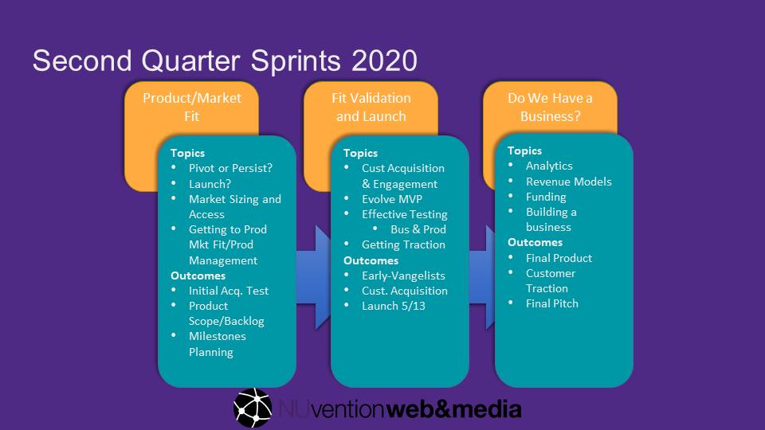

On Wednesday April 8, 2020, we began executing on the biggest mid course pivot we have ever made in teaching NUvention Web in 10 years--moving to remote instruction and coaching teams at mid-term through the "black swan" event of the COVID-19 crisis.

<!--more-->

#### NUvention Web+Media

NUvention Web is the two quarter course in software entrepreneurship I have been teaching for more than ten years. I wrote a [post recapping the first quarter](../2020-04-07-NUvention-Web+Media-2020-Q1/) prior to COVID

#### Changes

Probably the biggest change for our class is that teams will have to work together remotely and we won’t be physically in the class with our students to teach and coach each weeks. As instructors, the six faculty are also not in the same room. For the former, we are explicitly building in some help for remote work into the syllabus; for the later we are adjusting how we use “synchronous” time together as a class. We’ve used variations of the flipped classroom off and on throughout the history of the class; so we feel moderately well prepared to execute in this environment.

We are constructing some new lessons (some of which were lectures) as remote. For example:

- Remote research techniques by [Tran Ha](https://www.farley.northwestern.edu/people/faculty/tran-ha.html)
- The role of a product manager in a startup (Our former student [Nic Roth](https://www.linkedin.com/in/nicroth/) in conversation with Faculty [Rich Padula](https://www.farley.northwestern.edu/people/faculty/rich-padula.html)).
- A case study in get, keep, grow; based on my own experience with Divergent portfolio company [Socedo](https://toddwseattle.com/activity/Investment/Socedo)
- [Rich Gordon's](https://www.medill.northwestern.edu/directory/faculty/rich-gordon.html) case study of social media and content marketing using his band as an example.

A key part of NUvention Web is driving teams to launch products to real customers before the class ends in June. Teams have done terrifically this year; and we had more complete MVP starts and working code prototypes by the end of the Winter quarter than in past years (partly this is because of the continued surge of CS majors which make up more than half the class). Typically all of our teams have a working product by the end of the course; including if they have a mobile app, an app in the Apple or Google Play store. Most have a customer they are working with; and several will have generated some revenue.

In the middle of the spring quarter, we culminate their product release with a tradeshow/launch event. With COVID, that event will be an online webinar. We will ask teams to invite potential customers, as well as all of you to hear from the teams about their products, and ask questions of them as they present.

Our three sprints visually look like this:

#### Coaching through hard pivots

Most of our teams need to pivot to some degree because of COVID. For example, target businesses include things like restaurants, music venues, and health during international travel. In fact, the title of the presentation we have students do in the first session is **_"pivot or persist"_**

##### What do I mean by a hard pivot

For Pivot, we start with Eric Ries's definition explained in this [video](https://www.youtube.com/watch?v=dC_IG-EZQUY) and originally in this [blog post](http://www.startuplessonslearned.com/2009/06/pivot-dont-jump-to-new-vision.html). I also add a more 'technical' definition in the context of using the Business Model Canvas; which is pivot is a significant change to one or more (but not usually all) of the 9 quadrants of business model (value proposition, targeted customer segments, channels of distribution, customer relationship, revenue model, key resources, key activities, partnerships or cost structure) without a change in overall vision. In the course; because we are on a short timeframe, we tend to coach against what I call hitting the hyperspace button--which is starting over completely with just the current team. Usually, it means going back to the core need, and modifying the value proposition; or often finding an adjacent audience and need to the original target that is more likely to result in a viable business.

In cases like the three described--restaurants, music venues, and international travel; the needs have radically changed. Customers who were enthusiastic early adopters can't be reached by teams. Some of those customers are concerned with basic viability or have shut down. International travel is nearly non-existent right now. In those cases understanding the new COVID related pain point and shift in priorities is the key information to inform the shift, that is likely to occur in the most fundamental portions of the canvas, customer segment and value proposition.

Of course, in person interviews can't happen during the time of social distancing; which is why we added Tran's new module; which was also supplemented in a timely way by [Steve Blank's Blog Post on Customer Discovery in the time of Covid](https://steveblank.com/2020/04/07/customer-discovery-in-the-time-of-the-covid-19-virus/)

##### How do we coach teams to approach the pivot: Testing

Part of what teams presented over Zoom on Wednesday was a list of possible tests to run. As I mentioned in the post on the first quarter, we shifted from a pure focus on interviews, as most lean launchpad classes do,to a more intentional focus on specific tests from Osterwalder and Bland's [Testing Business Ideas](https://www.strategyzer.com/books/testing-business-ideas-david-j-bland).

As a follow up to their presentation, each team was to identify three to five tests to run, and complete at least one test. A test could be a hypothesis about a new segment, in which case they might interview potential customers in that segment. It could be that a shift in value proposition is more interesting customers now given the environmental change. In those cases, teams might run a landing page, social media campaign or both. In some cases, we proposed to teams they think about very quick MVP's that could work as lightening rods to attract early adopter users around acute, time critical needs (or fail completely--in which case the team will learn to look elsewhere without wasting much energy).

For each test, we also ask teams to get clear on the decision they will make based on evidence from the test.

Our first session with the class was great; and students are thoughtful and engaged. We ran the class as a critique, and we used the tool I built [Pitch Evaluator](https://pitcheval.com/?utm_source=todds_blog&utm_medium=blog&utm_campaign=web_recap). The technology (Zoom) even mostly worked, with the exception of their breakout rooms feature, which didn't work well for us to simulate "wandering around between the teams" as well as we had hoped. I'm looking forward to watching how they navigate these extraordinary times.
