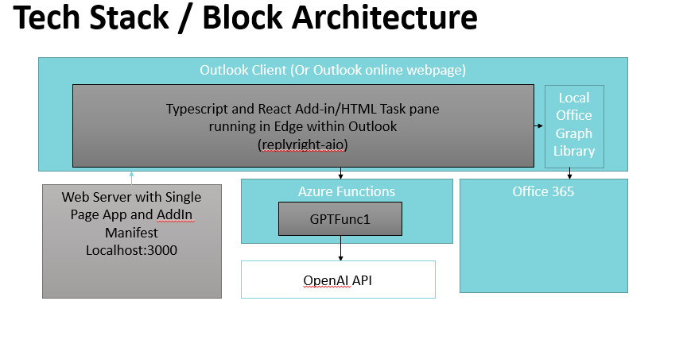

# Building an Outlook Add-in with OpenAI and Azure Functions

## Introduction

In this tutorial, we will be building an Outlook Add-in that uses the OpenAI completion API to generate email replies. The add-in will call an Azure Function to generate the email replies and will be built using TypeScript and React. This tutorial is intended for developers who have experience with JavaScript and TypeScript and are interested in building add-ins for Office applications.

Note, this is more an exploration.  Microsoft is adding these capabilities and more to office; and other have also developed commercial add-ins to office to use OpenAI.

## Solution

The solution we will be building is an Outlook Add-in that will allow users to generate email replies using the OpenAI completion API. The add-in will provide a button that the user can click to generate a reply. The reply will be generated by calling an Azure Function, which will in turn call the OpenAI API to generate the text. The generated text will then be inserted into the email as a reply.

## Technology Architecture

The technology architecture for this solution involves several components. The front-end of the add-in will be built using TypeScript and React, and will be hosted within Outlook. The add-in will call an Azure Function to generate the email replies, which will be written in TypeScript. The Azure Function will call the OpenAI API to generate the text, which will be returned to the add-in and inserted into the email.

## Tools and Developer Requirements

To follow along with this tutorial, you will need to have the following tools installed on your machine:
- [Visual Studio Code](https://code.visualstudio.com/docs/setup/setup-overview)
- [NodeJS](https://nodejs.org/en/download/)
- [Azure functions for Visual Studio Code](https://learn.microsoft.com/en-us/azure/azure-functions/functions-develop-vs-code)
- [Office Add-In Project Template](https://learn.microsoft.com/en-us/office/dev/add-ins/quickstarts/outlook-quickstart?tabs=yeomangenerator)

You will also need an Azure subscription, which can be set up for free. Additionally, you will need to have a basic understanding of JavaScript, TypeScript, and React.

## Conclusion

In the upcoming blog posts, we will walk through the steps to set up the development environment, build the Azure Function, create the Outlook Add-in, and test the solution. By the end of the tutorial, you will have a working Outlook Add-in that uses the OpenAI completion API to generate email replies. Let's get started!
