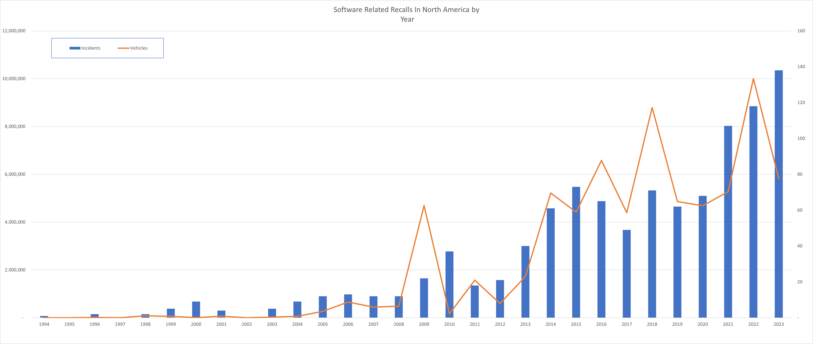

I've spent a good part of the last several years working on Automotive Software.  In 2022, while I was working at Ford in an interim role leading all vehicle and connected vehicle software, I got a closeup look at how critical software is to the function and perception of vehicles, especially EV's.  The industry still has significant work to do to improve software quality. As we start 2024, I wanted to take a step back, and look at what we can learn about vehicle software from the historical recall data from National Highway Safety Administration (NHTSA).
<!--more-->

I think it is imperative for Automotive OEM's and their suppliers to take a closer look at how they develop and release automotive software, their own and suppliers software capabilities, and how they work with customers and their dealer channel to affect software and vehicle quality. The evolution of the automotive industry has been remarkable, especially with the integration of software into vehicle systems. Software has introduced a new dimension of challenges, highlighted by the increase in software-related vehicle recalls.  In this analysis, I define a *software related recall* as one where either the corrective action or recall description mentions software.

An in-depth analysis of the [National Highway Traffic Safety Administration (NHTSA) Recall Data](https://datahub.transportation.gov/Automobiles/NHTSA-Recalls-by-Manufacturer/mu99-t4jn), from the end of 2023 extending back to 1966, reveals from the first appearance of a software recall in 1994, more than one thousand software related recalls, affecting potentially 70.1 million vehicles have occurred.  While automotive software was only involved in 5% of all recalls since 1966, it has risen in recent years to nearly 15% of all recall incidents in 2023.

#### The Dawn of the Software Recall Era 1994: The First mention of Software officially by the NHTSA

1994 marked a pivotal year in the NHTSA recall dataset as it was the first time software was mentioned in the context of vehicle recalls. [The first automotive software recall was in 1994, by BMW](https://www.nhtsa.gov/recalls?nhtsaId=94V219000) for a problem with a double lock feature that could lock keys and occupants inside the car.   The mitigation shows the beginning of a common problem in the thinking around software in automotive...instead of designing systems to think about updating software separately from the hardware; the software is viewed as integral to the specific part; and the owner was required to have the entire module replaced by the dealer; even though it was a software oriented fix.  

 While using Over the Air (OTA) software updates has been on the rise of late, there are still a large number of instances where the mitigation is replacing the entire module just to update the software.  The industry clearly needs to do more work around software update, including both the dealer and OTA.  Many, but not all of the newer entrants to automotive like Tesla have designed their systems with software update at the center--in the same way other consumer electronics like smart TV's and Phones are produced today.  I believe this is crucial.  My hypothesis is most legacy car makers think of software update as an after thought; not something that is endemic from the earliest milestones of automotive development, which it must be to be effective over the life cycle of the vehicle.

#### The Rise of Software in Vehicle Recalls

Since 1994, there has been a clear and steady increase in the number of incidents and vehicles involved in software-related recalls. The early 2000s saw a gradual rise, which became more pronounced in recent years. For instance, the data from 2015 and 2016 demonstrates significant spikes in both the number of incidents and vehicles affected.

 

#### Significant Recalls: From BMW to Toyota, and Tesla

While BMW's recall in 1994 was the first, the next significant milestone was the first recall that used a software change to affect more one million cars. That is a famous recall that occurred in 2009, [related to Toyota sudden acceleration](https://www.transportation.gov/briefing-room/us-department-transportation-releases-results-nhtsa-nasa-study-unintended-acceleration#:~:text=Toyota%20has%20recalled%20nearly%20eight%20million%20vehicles%20in,accelerator%20pedals%20to%20become%20trapped%20by%20floor%20mats.), [Toyota updated software to check for the application of the brake and accelerator together](https://www.nhtsa.gov/recalls?nhtsaId=09V388000) .  While the root cause of this failure was determined to be defective 3rd party floor mats, software was used to mitigate the situation in many instances.  While not an annual occurrence, twelve software related recalls have happened including the Toyota case that have potentially affected more then one million vehicles.   2023 was one of those years.  In 2023 the most significant recall was [Tesla's autopilot recall](https://www.nhtsa.gov/recalls?nhtsaId=23V838000) which affected over two million cars, showcasing the ongoing and evolving challenges faced by the industry.  Indeed, software involving the assistive driving stack:  from brakes and steering to autopilot has been a source of many of the impactful recalls that have occurred since 1994. 

#### Corrective Actions: A Software-Centric Approach

In software related recalls, more recalls indicate that software is used to correct a problem, rather than the software itself being an issue.   Additionally, as software is more malleable, it can provide a more cost effective way for auto makers to address hardware defects or deficiencies.   Automakers must develop a strong software delivery system, incorporating both over the air and dealer updates to be able to use this mechanism effectively.

|                        | Incidents | Potentially Affected Vehicles |
|------------------------|----------:|------------------------------:|
| **All Recalls**                | 20,958   | 999,161,831                   |
| **Software Related**           | 1,036    | 70,955,826                    |
| **Software in Corrective Action** | 892      | 66,828,290                    |
| **Software in Recall Description** | 466      | 22,938,723                    |

#### Looking Ahead: Implications for the Automotive Industry

The trend of increasing software-related recalls is a strong indicator of the critical role that software now plays in vehicle design and functionality. It underscores the need for robust software quality assurance processes and highlights the importance of ongoing software maintenance and updates.

#### Conclusion

The NHTSA data from 1966 to the present provides a valuable perspective on the evolving landscape of vehicle recalls, with a particular focus on the role of software since 1994. The journey from the BMW recall to the significant Tesla recall in 2023 illustrates the growing complexities and challenges in automotive safety. As we continue to navigate this software-centric era, the insights from this data are vital for shaping the future of automotive safety and reliability.  In our [next post](/blog/2024-01-17-Automotive-Software-Recalls-2023) we will dig deep into what happened with software related recalls in 2023.

