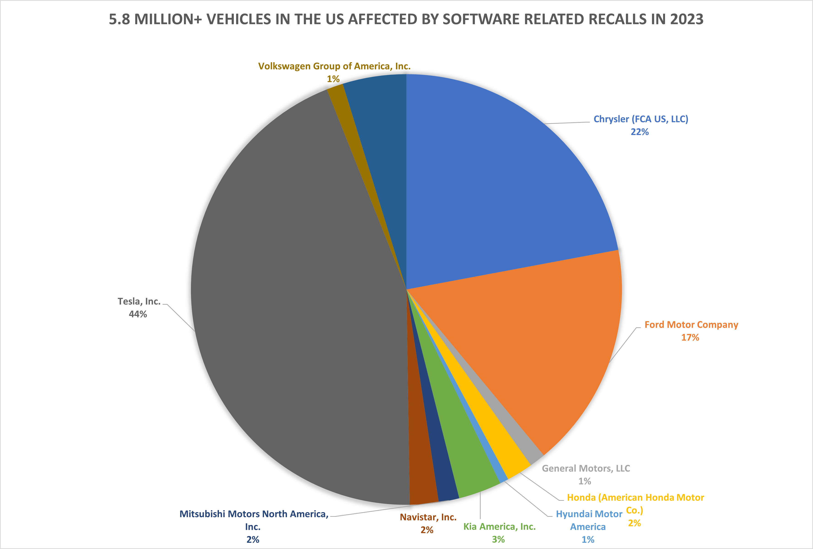

#### Automotive Software Related Recalls

In my [previous post](/blog/2024-01-08-Software-Related-Recalls), I examined the rise of software in the automotive industry and its impact on vehicle recalls, using data from the National Highway Traffic Safety Administration (NHTSA). This post will provide a detailed look at the software-related recalls in 2023, exploring their implications for the automotive industry, differences between new entrants and incumbents, and particular areas of focus.   2023 marked the point where the industry has experienced the highest number of software related vehicles to date, with 144, representing nearly 15% of all recall incidents (another high water mark).   As a reminder, these recalls are defined as manufacturer-initiated actions in response to software issues that could affect vehicle safety or compliance; it also reflects hardware issues that were solved with a software fix.
<!--more-->
#### The Software Defined Vehicle Age

While software has been in vehicles since at least the early 80's (the first reference to software in a recall is 1984), by the mid 2000's it had become more pervasive; and indeed many of the key value proposition elements of modern cars are reliant on software:  Infotainment, Assistive Driving, Electric Drive Train.  Indeed, during my consulting to the automotive industry I have learned that fuel efficiency advances in internal combustion engines are reliant completely on software advances, rather than new mechanical or chemistry technics (until maybe hydrogen).   The age probably began with the Tesla Model S, the first vehicle to provide over the air software updates in 2012 (The first mention of using an OTA to address a recall was the Model S in 2014).

#### What happened with software related recalls in 2023?

While Ford and Honda had the most overall recalls according to [this article in autoevolution](https://www.autoevolution.com/news/ford-issued-58-recalls-totaling-61-million-vehicles-in-2023-honda-recalled-even-more-227442.html) with many related to physical problems like air bags, wiring, and fuel pumps, software has had an increasing role.  More than 5.8 million vehicles were affected by software related recalls in the US.  Ford also makes the list of top makers of vehicles affected by software recalls, though Tesla recalled more vehicles with a software remedy than Chrysler and Ford (#2 and #3) combined:  

And here are the top five individual recalls affecting the most vehicles:

| NHTSA ID   | Manufacturer            | Subject                                           | Vehicles Affected |
|------------|-------------------------|---------------------------------------------------|-------------------|
| [23V838000](https://www.nhtsa.gov/recalls?nhtsaId=23V838000)  | Tesla, Inc.             | Autopilot Controls Insufficient to Prevent Misuse | 2,031,220         |
| [23V022000](https://www.nhtsa.gov/recalls?nhtsaId=23V022000)  | Ford Motor Company      | Rearview Camera Image May Not Display             | 382,759           |
| [23V085000](https://www.nhtsa.gov/recalls?nhtsaId=23V085000)  | Tesla, Inc.             | Full Self-Driving Software May Cause Crash        | 362,758           |
| [23V654000](https://www.nhtsa.gov/recalls?nhtsaId=23V654000)  | Chrysler (FCA US, LLC)  | Rearview Image May Not Display/FMVSS 111          | 272,911           |
| [23V848000](https://www.nhtsa.gov/recalls?nhtsaId=23V848000)  | Ford Motor Company      | Missing Warning for Turn Signal Failure/FMVSS 108 | 189,814           |
| [23V727000](https://www.nhtsa.gov/recalls?nhtsaId=23V727000)  | Ford Motor Company      | Low Brake Fluid Warning Inoperative/FMVSS 135     | 187,922           |
| [23V576000](https://www.nhtsa.gov/recalls?nhtsaId=23V576000)  | Chrysler (FCA US, LLC)  | Instrument Panel Lighting Not Adjustable/FMVSS 101| 181,999           |
| [23V598000](https://www.nhtsa.gov/recalls?nhtsaId=23V598000)  | Ford Motor Company      | Rearview Camera Image May Not Display             | 177,402           |
| [23V301000](https://www.nhtsa.gov/recalls?nhtsaId=23V301000)  | Chrysler (FCA US, LLC)  | Unsecured Transmission May Cause Rollaway         | 165,503           |
| [23V577000](https://www.nhtsa.gov/recalls?nhtsaId=23V577000)  | Chrysler (FCA US, LLC)  | Rearview Camera Image May Not Display/FMVSS 111   | 162,713           |

Both the manufacturer data and the top recalls are dominated by the Autopilot and Tesla full self driving problems.  Indeed, while we should expect software for assistive driving to get better over time, we are likely to see more such incidents in the future for all manufactures.  Assistive driving software is complex, involving many elements of the vehicle, additionally it needs to interact with the unpredictable nature of the real world.

The other area that has had troublesome software related to recalls is rearview cameras.  Rearview cameras have been required for new vehicles since 2018; in 2023 faulty camera software accounted for more than 1.3m potentially affected vehicles in automotive software related recalls; affecting a large number of manufacturers including Tesla, Chrysler, Ford, VW, Honda and Lucid.   Most of these manufacturers source this component from a tier one supplier.  "no image" often is because the embedded software within this camera crashed or hung; or integrated in a poor way with the vehicle bus and infotainment system.  It's clear to me that as software becomes a more important part of the automotive supply chain; building better processes and having better tools for insuring these components are well tested is critically important to automotive product development, and putting those elements in place was some of the key work I have done with envorso at car makers and suppliers--but there is more to do.

Other than tesla, most of the top automotive software recalls in terms of impact are dominated by incumbent car makers Ford and Chrysler.   That said, new entrants, who generally have smaller volume were not immune from problems.   Indeed, Lucid, Rivian, VinFast, and Lordstown all suffered from automotive software related recalls.  Lucid had the most relative trouble, with 4 recalls affecting potentially 2,990 vehicles.  While many vehicles may have multiple recalls; it indicates between 25% and 50% of Lucid's delivered vehicles were impacted. Based on published reports; VinFast's recall also likely impacted their entire fleet sold in the US. 

#### OTA increases its role in addressing recalls

Over the Air (OTA) updates increased their prevalence in 2023.  All of Tesla's software related recalls; including the biggest, were remedied with Over the Air Updates, eliminating the need for a dealer visit. 19 software recalls were remedied with over the air updates; still only a small fraction--13%--of automotive software related recalls.  The industry goal should be to raise this much higher; and it's an indication of the relative weakness of OTA systems employed by OEMs.  

| Manufacturer                           | Number of OTA Updates |
|----------------------------------------|-----------------------|
| Tesla, Inc.                            | 6                     |
| Lucid USA, Inc.                        | 3                     |
| Toyota Motor Engineering & Manufacturing | 2                     |
| Ford Motor Company                     | 2                     |
| General Motors, LLC                    | 1                     |
| Volvo Car USA, LLC                     | 1                     |
| Jaguar Land Rover North America, LLC   | 1                     |
| Rivian Automotive, LLC                 | 1                     |
| Cruise LLC                             | 1                     |
| Lonestar Specialty Vehicles            | 1                     |

#### Non-OTA Updates: When a Dealer Visit Becomes Necessary to Fix Automotive Software

All too often, a automotive software related recall requires intervention at the dealer; often including replacing a part even though software is the only problem.   Here are the top five most impactful software recalls that required a dealer visit: 

| NHTSA ID   | Manufacturer            | Subject                                           | Vehicles Affected |
|------------|-------------------------|---------------------------------------------------|-------------------|
| [23V022000](https://www.nhtsa.gov/recalls?nhtsaId=23V022000)  | Ford Motor Company      | Rearview Camera Image May Not Display             | 382,759           |
| [23V598000](https://www.nhtsa.gov/recalls?nhtsaId=23V598000)  | Ford Motor Company      | Rearview Camera Image May Not Display             | 177,402           |
| [23V301000](https://www.nhtsa.gov/recalls?nhtsaId=23V301000)  | Chrysler (FCA US, LLC)  | Unsecured Transmission May Cause Rollaway         | 165,503           |
| [23V116000](https://www.nhtsa.gov/recalls?nhtsaId=23V116000)  | Chrysler (FCA US, LLC)  | Clutch Pressure Plate May Overheat                | 69,201            |
| [23V787000](https://www.nhtsa.gov/recalls?nhtsaId=23V787000)  | Chrysler (FCA US, LLC)  | High Voltage Battery May Fail and Cause Fire      | 32,125            |

Even the new EV manufacturers were not immune.  [Lucid also had a recall](https://www.nhtsa.gov/recalls?23V110000) that required a dealer visit for a software related upgrade.  Especially with less capable modules (i.e. those with less memory and processing power), or those where updating the software inhibits vehicle operation, the current OTA systems and modules have trouble handling them due to ECU limitations or inter-module dependencies.   It's important for OEM's to be vigilant to insure the updatability of all software.  Tesla is still the market leader here.

#### Conclusion: Accelerating Innovation and Resilience in Automotive Software

Reflecting on the events and teachings from the 2023 automotive software recalls, it's apparent that the industry is at a pivotal point in its evolution. The prominence of software in automotive design brings forth unique challenges and avenues for growth. Here are the essential actions and implications for moving forward:

1. **Enhanced Software Quality Assurance**: The increase in software-related recalls highlights the need for more rigorous quality assurance processes. Automotive companies must invest in comprehensive software testing and validation, integrating these practices throughout the development cycle.

2. **Improving OTA Updates for Rapid Response**: Advancing Over-The-Air (OTA) update capabilities is crucial for swift response to software issues, significantly reducing reaction times and costs. Embracing fast iteration in development processes enables manufacturers to quickly roll out necessary updates, lessening the impact on consumers and business operations.

3. **Strengthening Internal Software Development and Supplier Integration**: Upping the ante on internal software development capabilities is key. Additionally, fostering better integration and collaboration with software suppliers can lead to more seamless and efficient development processes, ensuring that software components from different sources work harmoniously together.

4. **Regulatory Adaptation**: As the role of software in vehicles expands, regulatory bodies must adapt their frameworks to address these new challenges. This includes setting rigorous software safety standards and ensuring transparent reporting of software-related issues.

5. **Consumer Education and Transparency**: Maintaining clear communication with consumers regarding software functionalities and updates is paramount. Educating customers about the role of software in modern vehicles and the importance of timely updates is crucial for ensuring safety and trust.  Insuring the entire channel, especially dealers, understand how to properly communicate with customers around vehicle software issues is crucial.

7. **Leveraging Data Analytics**: While not discussed in this post, connected vehicles provide great systematic telemetry.  Employing data analytics can yield valuable insights into software performance and potential vulnerabilities, fostering a proactive stance in identifying and addressing issues before they necessitate recalls.   Any company that has a software defect that rises to recall level severity, needs to understand how they must adapt their telemetry to avoid related problems in the future.

The learnings from 2023's software recalls are vital in shaping the future of automotive innovation. By concentrating on these critical areas, automakers can not only reduce risks but also drive the industry towards an era of enhanced, reliable, and cutting-edge automotive software.
