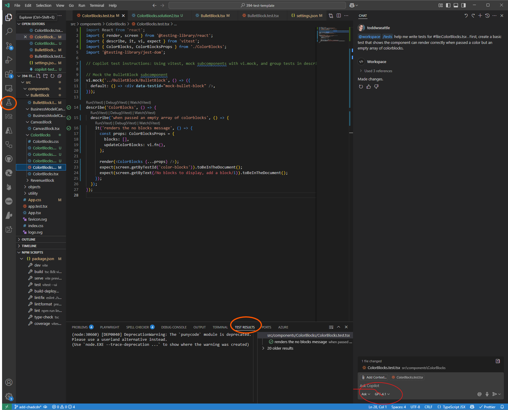

##### Introduction

React traditionally pairs well with testing tools, with Jest being the standard choice for years. Now, [Vite](https://vitejs.dev) and its test runner [Vitest](https://vitest.dev) offer a faster, more seamless alternative.

Unit testing ensures code reliability during development and refactoring but is often seen as tedious due to boilerplate code and complex test setup. GitHub Copilot significantly reduces this burden. This post shows how to effectively combine React, Vitest, and Copilot to create robust unit tests with less effort.

> **TL;DR:** Set up Vitest with React Testing Library, configure Copilot test instructions, and use an incremental approach to generate tests. Start with basic tests and build up to more complex scenarios while watching for common pitfalls like mixed matchers and incorrect assumptions.

For more on React testing fundamentals, see Chris Riesbeck's [resources](https://courses.cs.northwestern.edu/394/guides/overviews.php).

#### Table of Contents

- [Setting up the Development Environment](#setting-up-the-development-environment)
- [Writing Tests with Vitest](#writing-tests-with-vitest)
- [Using Copilot with Vitest and React](#using-copilot-with-vitest-and-react)
- [Example Component and Testing](#example-component-and-testing)
- [Common Pitfalls to Watch For](#common-pitfalls-to-watch-for)

#### Setting up the Development Environment

Already using Vitest and React? Skip to [configuring VSCode](#configuring-vscode-for-github-copilot-and-vitest).

##### Prerequisites

For Node.js and VSCode installation and configuration, see my [VSCode and Node.js setup recommendations](https://toddwseattle.com/blog/2025-03-15-VSCode-Setup-Recomendations/) which covers optimal editor settings, essential extensions, and Node.js configuration for React development.

##### Configuring Vitest

Follow the [Vitest documentation](https://vitest.dev/guide/) for setup instructions, including [TypeScript support](https://vitest.dev/guide/features.html#typescript) if needed.

For a ready-made setup, use my [CS394 starter project](https://github.com/toddwseattle/pretty-vitest-react-ts-template) with React, TypeScript, Vitest, ESLint, and Prettier pre-configured.

##### Configuring VSCode for GitHub Copilot and Vitest

1. **Install GitHub Copilot**

   - Students: Get it free via the [GitHub Student Developer Pack](https://education.github.com/pack)
   - Others: Subscribe at [GitHub Copilot Plans](https://github.com/features/copilot/plans)
   - Install the [VSCode extension](https://github.com/github/copilot-docs/blob/main/docs/getting-started.md#install-github-copilot-in-visual-studio-code)

2. **Install Vitest Extension**
   - Search for "Vitest" in the Extensions view or install from [Vitest - Visual Studio Marketplace](https://marketplace.visualstudio.com/items?itemName=vitest.vitest-explorer)

#### Writing Tests with Vitest

For detailed guidance on testing React components with Vitest, see Chris Riesbeck's [testing slides](https://courses.cs.northwestern.edu/394/slides/reveal.js-master/testing-details.html#/1).

Essential setup libraries:

```bash
npm install --save-dev @testing-library/jest-dom @testing-library/react
```

#### Using Copilot with Vitest and React


_Screenshot showing Copilot chat panel (right), testing explorer (left), and test results panel (bottom)_

Activate Copilot with `Ctrl+K I`. Use 'ask' mode for test generation with commands like '/tests'. The test results appear in the lower right panel, and you can view test files by clicking the flask icon.

##### Setting up Copilot Test Instructions

Create `.github/copilot-test-instructions.md` in your project root:

```markdown
Always use vitest and never jest.
Mock sub components using `vi.mock` and not `jest.mock`.
create mock sub components rather than using the real ones unless specified otherwise.
Place all tests in a describe block. Create sub describe blocks for specific methods or functionality within the component.
Indicate you are using these copilot test instructions in the first line of your test file.
```

Configure VSCode to use these instructions in `.vscode/settings.json`:

```json
{
  "github.copilot.testGenerationInstructions": ".github/copilot-test-instructions.md"
}
```

##### Effective Test Generation Strategy

While using `/tests` generates tests automatically, an incremental approach works better:

1. Common issues with bulk generation:

   - Mixed Jest/Chai matchers
   - Testing non-existent functionality
   - Cascade of errors that are harder to fix

2. Start small and build up:
   - Create a basic test first
   - Add more complex tests incrementally
   - Fix errors as you go

##### Common Pitfalls to Watch For

- Assuming non-existent attributes (e.g., `data-testid` that doesn't exist)
- Using Jest functions instead of Vitest equivalents (e.g., `jest.fn()` vs `vi.fn()`)
- CSS testing issues (React Testing Library returns `rgb(255,0,0)` for `color: red`)
- Non-existent matchers

When errors occur, describe them to Copilot for correction. Remember that sometimes the issue is in your component, not the test.

Use the Vitest extension's coverage report (via the "play with timer" icon) to ensure thorough testing.

> **Pro Tip:** If you find Copilot generating inconsistent tests, create a small working example first, then ask it to generate similar tests for other components following that pattern.

#### Troubleshooting

| Problem                                                 | Solution                                                                                                                                                            |
| ------------------------------------------------------- | ------------------------------------------------------------------------------------------------------------------------------------------------------------------- |
| Tests use Jest matchers instead of Vitest               | Double-check imports and ensure your test instructions specify Vitest                                                                                               |
| "Cannot find module" errors                             | Check your import paths and make sure all dependencies are installed in `package.json`                                                                              |
| Tests pass locally but fail in CI                       | Ensure environment variables and test setup files are properly configured in your CI pipeline                                                                       |
| Copilot generates incorrect component structure         | Show Copilot your actual component structure by referencing the file in the prompt (precede name with a `#`) or copying the component code directly into the prompt |
| Copilot generates tests that don't match your component | Reference the component file as above and describe the specific discrepancies in the prompt.                                                                        |

#### Example Component and Testing

Here's our sample `ColorBlocks` component:

```typescript
/*** ColorBlocks React component Creates a set of color blocks for an array of blocks, where each block contains an array of strings
 *  the component takes a valid css color as well as the array of blocks
 * **/
import "./ColorBlocks.css"

import React, { useState } from "react"

import BulletBlock from "../BulletBlock/BulletBlock"
export interface ColorBlock {
  color: string
  content: string[]
}
export interface ColorBlocksProps {
  blocks: ColorBlock[]
  updateColorBlocks: (blocks: ColorBlock[]) => void
}
export const ColorBlocks: React.FC<ColorBlocksProps> = ({
  blocks,
  updateColorBlocks,
}) => {
  const [currentBlocks, setCurrentBlocks] = useState(blocks)
  const updateColorBlockStrings = (index: number, newBlocks: string[]) => {
    const newColorBlocks = [...currentBlocks]
    newColorBlocks[index].content = newBlocks
    setCurrentBlocks(newColorBlocks)
    updateColorBlocks(newColorBlocks)
  }

  return (
    <div data-testid="color-blocks">
      {blocks && blocks.length > 0 ? (
        blocks.map((block, index) => (
          <div
            key={index}
            className="color-block"
            data-testid="color-block"
            style={{ backgroundColor: block.color }}
          >
            <BulletBlock
              items={block.content}
              onSave={newBlocks => updateColorBlockStrings(index, newBlocks)}
            />
          </div>
        ))
      ) : (
        <div>No blocks to display, add a block</div>
      )}
    </div>
  )
}
```

###### Step 1: Create a Basic Test

In `ColorBlocks.test.tsx`, use this prompt in Copilot:

```
@workspace /tests help me write tests for #file:ColorBlocks.tsx . First, create a basic test that shows the component can render correctly when passed a color but an empty array of colorblocks.
```

Import the necessary libraries:

```typescript
import "@testing-library/jest-dom"
import { render } from "@testing-library/react"
import { describe, expect, test, vi } from "vitest"
```

Your first test might look like:

```typescript
import React from "react"
import { render, screen } from "@testing-library/react"
import { describe, it, vi, expect } from "vitest"
import { ColorBlocks, ColorBlocksProps } from "./ColorBlocks"
import "@testing-library/jest-dom"

// Copilot test instructions: Using vitest, mock subcomponents with vi.mock, and group tests in describe blocks as instructed.

// Mock the BulletBlock subcomponent
vi.mock("../BulletBlock/BulletBlock", () => ({
  default: () => <div data-testid="mock-bullet-block" />,
}))

describe("ColorBlocks", () => {
  describe("when passed an empty array of colorblocks", () => {
    it("renders the no blocks message", () => {
      const props: ColorBlocksProps = {
        blocks: [],
        updateColorBlocks: vi.fn(),
      }

      render(<ColorBlocks {...props} />)
      expect(screen.getByTestId("color-blocks")).toBeInTheDocument()
      expect(
        screen.getByText(/No blocks to display, add a block/i)
      ).toBeInTheDocument()
    })
  })
})
```

###### Step 2: Identify Additional Test Cases

Following Kent Beck's [canon TDD](https://tidyfirst.substack.com/p/canon-tdd) approach, list additional tests:

```
Here are some additional Tests to add:
  - It should render the component correctly when passed a single colorblock, with a single string
  - It should render the component properly when passed a single colorblock with multiple strings
  - It should render the component properly when passed multiple color blocks that contain multiple strings
  - It should properly call the updateColorBlocks callback if the bullet points are entered
```

###### Complete Test Implementation

Here's the final implementation after adding all test cases through the incremental approach described above:

```typescript
// Copilot test instructions: Using vitest, mock subcomponents with vi.mock, and group tests in describe blocks as instructed.

import React from "react"
import { render, screen, fireEvent } from "@testing-library/react"
import { describe, it, vi, expect } from "vitest"
import { ColorBlocks, ColorBlocksProps } from "./ColorBlocks"
import "@testing-library/jest-dom"
// Mock the BulletBlock subcomponent
const mockOnSave = vi.fn()
vi.mock("../BulletBlock/BulletBlock", () => ({
  __esModule: true,
  default: (props: any) => (
    <div data-testid="mock-bullet-block">
      <button
        data-testid="mock-save"
        onClick={() => props.onSave(["new item"])}
      >
        Save
      </button>
      {props.items &&
        props.items.map((item: string, idx: number) => (
          <div key={idx} data-testid="mock-bullet-item">
            {item}
          </div>
        ))}
    </div>
  ),
}))

describe("ColorBlocks", () => {
  describe("when passed an empty array of colorblocks", () => {
    it("renders the no blocks message", () => {
      const props: ColorBlocksProps = {
        blocks: [],
        updateColorBlocks: vi.fn(),
      }

      render(<ColorBlocks {...props} />)
      expect(screen.getByTestId("color-blocks")).toBeInTheDocument()
      expect(
        screen.getByText(/No blocks to display, add a block/i)
      ).toBeInTheDocument()
    })
  })

  describe("when passed a single colorblock with a single string", () => {
    it("renders the colorblock and its string", () => {
      const props: ColorBlocksProps = {
        blocks: [
          {
            id: "1",
            color: "red",
            title: "Block 1",
            content: ["Item 1"],
          },
        ],
        updateColorBlocks: vi.fn(),
      }

      render(<ColorBlocks {...props} />)
      expect(screen.getByTestId("color-blocks")).toBeInTheDocument()
      expect(screen.getByTestId("color-block")).toBeInTheDocument()
      expect(screen.getByText("Block 1")).toBeInTheDocument()
      expect(screen.getByTestId("mock-bullet-block")).toBeInTheDocument()
      expect(screen.getByText("Item 1")).toBeInTheDocument()
    })
  })

  describe("when passed a single colorblock with multiple strings", () => {
    it("renders the colorblock and all its strings", () => {
      const props: ColorBlocksProps = {
        blocks: [
          {
            id: "2",
            color: "blue",
            title: "Block 2",
            content: ["First", "Second", "Third"],
          },
        ],
        updateColorBlocks: vi.fn(),
      }

      render(<ColorBlocks {...props} />)
      expect(screen.getByTestId("color-block")).toBeInTheDocument()
      expect(screen.getByText("Block 2")).toBeInTheDocument()
      expect(screen.getAllByTestId("mock-bullet-item")).toHaveLength(3)
      expect(screen.getByText("First")).toBeInTheDocument()
      expect(screen.getByText("Second")).toBeInTheDocument()
      expect(screen.getByText("Third")).toBeInTheDocument()
    })
  })

  describe("when passed multiple colorblocks with multiple strings", () => {
    it("renders all colorblocks and their strings", () => {
      const props: ColorBlocksProps = {
        blocks: [
          {
            id: "3",
            color: "green",
            title: "Block 3",
            content: ["A", "B"],
          },
          {
            id: "4",
            color: "yellow",
            title: "Block 4",
            content: ["X", "Y", "Z"],
          },
        ],
        updateColorBlocks: vi.fn(),
      }

      render(<ColorBlocks {...props} />)
      const colorBlocks = screen.getAllByTestId("color-block")
      expect(colorBlocks).toHaveLength(2)
      expect(screen.getByText("Block 3")).toBeInTheDocument()
      expect(screen.getByText("Block 4")).toBeInTheDocument()
      expect(screen.getAllByTestId("mock-bullet-block")).toHaveLength(2)
      expect(screen.getByText("A")).toBeInTheDocument()
      expect(screen.getByText("B")).toBeInTheDocument()
      expect(screen.getByText("X")).toBeInTheDocument()
      expect(screen.getByText("Y")).toBeInTheDocument()
      expect(screen.getByText("Z")).toBeInTheDocument()
    })
  })

  describe("when bullet points are entered", () => {
    it("calls updateColorBlocks callback", () => {
      const updateColorBlocks = vi.fn()
      const props: ColorBlocksProps = {
        blocks: [
          {
            id: "5",
            color: "purple",
            title: "Block 5",
            content: ["Old"],
          },
        ],
        updateColorBlocks,
      }

      render(<ColorBlocks {...props} />)
      const saveButton = screen.getByTestId("mock-save")
      fireEvent.click(saveButton)
      expect(updateColorBlocks).toHaveBeenCalledWith([
        {
          id: "5",
          color: "purple",
          title: "Block 5",
          content: ["new item"],
        },
      ])
    })
  })
})
```

##### Common Pitfalls to Watch For

- Assuming non-existent attributes (e.g., `data-testid` that doesn't exist)
- Using Jest functions instead of Vitest equivalents (e.g., `jest.fn()` vs `vi.fn()`)
- CSS testing issues (React Testing Library returns `rgb(255,0,0)` for `color: red`)
- Non-existent matchers

When errors occur, describe them to Copilot for correction. Remember that sometimes the issue is in your component, not the test.

Use the Vitest extension's coverage report (via the "play with timer" icon) to ensure thorough testing.

> **Pro Tip:** If you find Copilot generating inconsistent tests, create a small working example first, then ask it to generate similar tests for other components following that pattern.

#### Troubleshooting

| Problem                                         | Solution                                                                                         |
| ----------------------------------------------- | ------------------------------------------------------------------------------------------------ |
| Tests use Jest matchers instead of Vitest       | Double-check imports and ensure your test instructions specify Vitest                            |
| "Cannot find module" errors                     | Check your import paths and make sure all dependencies are installed                             |
| Tests pass locally but fail in CI               | Ensure environment variables and test setup files are properly configured in your CI pipeline    |
| Copilot generates incorrect component structure | Show Copilot your actual component structure by copying the component definition into the prompt |

#### Conclusion

Testing React components with Vitest and GitHub Copilot can dramatically improve your development workflow. The incremental approach—starting with simple tests and building up—produces the most reliable results. While Copilot isn't perfect, providing clear instructions and fixing small issues as you go leads to high-quality tests with much less manual coding.

##### Further Reading

- [Vitest Official Documentation](https://vitest.dev/)
- [Testing Library Best Practices](https://testing-library.com/docs/react-testing-library/intro/)
- [Kent Beck on Test-Driven Development](https://www.amazon.com/Test-Driven-Development-Kent-Beck/dp/0321146530)

Happy Testing!

#### Final Notes

Updated May 27, 2025 to reflect current best practices in Vitest and GitHub Copilot for React component testing.
